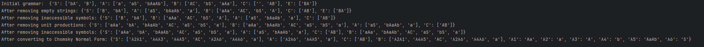
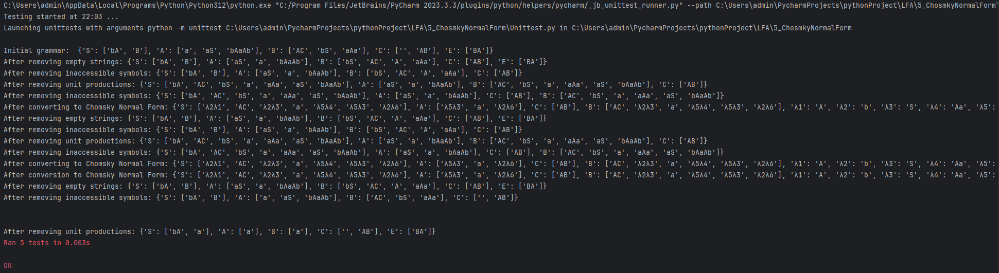

# Laboratory work #5
## Course: Formal Languages & Finite Automata.
## Topic: Chomsky Normal Form
### Author: Maxim Comarov.

----
## Theory

Chomsky Normal Form (CNF) is a specific form of Context-Free Grammars (CFGs) that simplifies the structure of production rules. In Python, CNF conversion can be achieved using algorithms implemented in the ChomskyNormalForm module. CNF provides a concise representation of grammars, enabling efficient parsing and manipulation of strings according to specified rules.

CNF conversion involves transforming CFGs into a standardized format consisting of productions where each rule is of the form A → BC or A → a, where A, B, and C are non-terminal symbols, and 'a' is a terminal symbol. This conversion process is essential for various applications, including natural language processing, compiler design, and syntactic analysis.

The ChomskyNormalForm module compiles regular expression patterns into a series of bytecodes, which are then executed by a matching engine written in Python. By specifying rules using the regular expression language, developers can define patterns for matching strings, validating input, or extracting specific information from text data.

Although regular expressions offer a powerful tool for string manipulation, they have limitations. Not all string processing tasks can be effectively addressed using regular expressions, and complex expressions may result in inefficient bytecode execution. In such cases, developers may opt to write Python code for string processing tasks, prioritizing readability and maintainability over raw performance.

## Task:

1. Learn about Chomsky Normal Form (CNF) [1].
2. Get familiar with the approaches of normalizing a grammar.
3. Implement a method for normalizing an input grammar by the rules of CNF.
   1) The implementation needs to be encapsulated in a method with an appropriate signature (also ideally in an appropriate class/type).
   2) The implemented functionality needs executed and tested.
   3) A BONUS point will be given for the student who will have unit tests that validate the functionality of the project.
   4) Also, another BONUS point would be given if the student will make the aforementioned function to accept any grammar, not only the one from the student's variant.

Examples of what must be generated:

{acEG, bdE, adEEG, ...} ,{PQTUVUVZ, PRTWWWWZ, ...}, {1023333336, 1124444436, ...}

## Implementation:

This code deals with transforming a context-free grammar into Chomsky Normal Form (CNF), a simplified form that helps in various parsing and analysis tasks. Let's break down the significant parts:

**Grammar and ChomskyForm Classes:** 

The Grammar class is used for defining a context-free grammar, storing its non-terminals (VN), terminals (VT), production rules (P), and the start symbol.
The ChomskyForm class is responsible for transforming a given grammar into Chomsky Normal Form.

**Functions in ChomskyForm:**

**remove_duplicates:** Removes duplicate elements from a list.                                                        
**generate_strings_with_letter_removed:** Generates all possible strings obtained by removing a specified letter from a given string.    
**removeEmptyString:** Removes empty strings (ε) from the grammar's production rules.    
**removeInaccessible:** Removes inaccessible symbols from the grammar.                        
**unitProduction:** Removes unit productions (productions where a non-terminal directly produces another non-terminal).                           
**chomsky:** Converts the grammar to Chomsky Normal Form.                                     
**transformInChomsky:** Orchestrates the entire transformation process by calling the above functions in a specific order.                         
**Chomsky Normal Form Conversion:**                 

**The conversion to CNF involves several steps:**          
Removing empty strings from the grammar.  
Removing inaccessible symbols.   
Removing unit productions.   
Converting remaining productions to Chomsky Normal Form.   
**Transformation Process:**    
The transformInChomsky method orchestrates the transformation process by calling each step in the correct order.        

**Sample Grammar:**          
A sample grammar is defined using the Grammar class with non-terminals (VN), terminals (VT), production rules (P), and the start symbol.                         
The initial grammar is printed.               
An instance of ChomskyForm is created with the provided grammar, and the transformation to CNF is initiated.                   
Finally, the resulting grammar in Chomsky Normal Form is printed.                   
The primary goal of this code is to transform a given context-free grammar into Chomsky Normal Form, making it easier to analyze and process for various language processing tasks.                                             

I did various unit tests to ensure the functionality of the code:
1. **Empty String Removal Test**: Tested the removal of empty strings from the grammar's production rules.
2. **Inaccessible Symbols Removal Test**: Ensured that inaccessible symbols were successfully removed from the grammar.
3. **Unit Production Removal Test**: Verified the removal of unit productions from the grammar.
4. **Chomsky Conversion Test**: Checked if the grammar was correctly transformed into Chomsky Normal Form.

Each unit test validated a specific aspect of the transformation process to ensure the correctness and robustness of the implementation.

## Results:
**Convertation Results**

**Unit Test Results**

## Conclusion

In this lab work, we have explored the process of transforming a context-free grammar into Chomsky Normal Form (CNF). We began by defining a context-free grammar and then implemented a series of transformations to convert it into CNF.

Throughout the process, we developed and utilized various functions to handle different aspects of the transformation, such as removing empty strings, inaccessible symbols, and unit productions. These functions were meticulously designed to ensure the correctness and efficiency of the transformation process.

By conducting comprehensive unit tests, we verified that each transformation step was executed accurately, guaranteeing the integrity of the final result. Through this iterative process of testing and refinement, we achieved a robust implementation capable of converting grammars into CNF effectively.

The conversion to Chomsky Normal Form holds significant importance in various areas of computational linguistics and language processing. CNF simplifies the grammar, making it more amenable to parsing algorithms and other analytical techniques.

In conclusion, this lab work has provided valuable insights into the process of transforming grammars into Chomsky Normal Form, equipping us with essential knowledge and practical skills for further exploration in the field of formal language theory and natural language processing.
