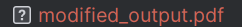
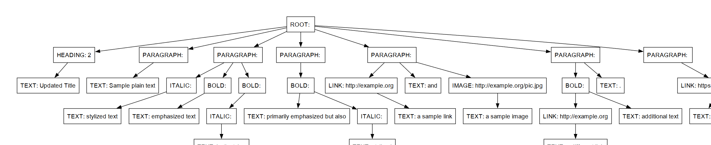

# Laboratory work #6
## Course: Formal Languages & Finite Automata.
## Topic: Parser & Building an Abstract Syntax Tree
### Author: Maxim Comarov.

----
## Theory

 The process of gathering syntactical meaning or doing a syntactical analysis over some text can also be called parsing. It usually results in a parse tree which can also contain semantic information that could be used in subsequent stages of compilation, for example.

Similarly to a parse tree, in order to represent the structure of an input text one could create an Abstract Syntax Tree (AST). This is a data structure that is organized hierarchically in abstraction layers that represent the constructs or entities that form up the initial text. These can come in handy also in the analysis of programs or some processes involved in compilation.

## Task:

1. Get familiar with parsing, what it is and how it can be programmed [1].
2. Get familiar with the concept of AST [2].
3. In addition to what has been done in the 3rd lab work do the following:
   1. In case you didn't have a type that denotes the possible types of tokens you need to:
      1. Have a type __*TokenType*__ (like an enum) that can be used in the lexical analysis to categorize the tokens. 
      2. Please use regular expressions to identify the type of the token.
   2. Implement the necessary data structures for an AST that could be used for the text you have processed in the 3rd lab work.
   3. Implement a simple parser program that could extract the syntactic information from the input text.

## Implementation:

Here’s an explanation of my implementation:

- **tokenize(text)** - Analyzes a given text string and breaks it down into lexemes (tokens) based on predefined patterns of Markdown syntax (like headers, links, images). It identifies each token's type and content, ignoring whitespace unless they are part of the token's content. Each recognized token is appended to a list of tokens, and the function returns this list.

- **__init__(self, token_type, content, offset)** - Constructor for the `Lexeme` class that initializes a token with its type, content, and the offset position in the original text where it was found.

- **__str__(self)** - Provides a string representation of a `Lexeme` instance, mainly for debugging, which includes the token type and its content.

- **__init__(self, element_kind, element_value, input_lexemes: List[Lexeme], progeny=None)** - Constructor for the `Element` class that initializes an AST (Abstract Syntax Tree) node with a specific type (like ROOT, PARAGRAPH, LINK), value, and children. Depending on the node type, it processes either paragraphs or inline content using private methods.

- **__parse_paragraphs__(self)** - Parses tokens to form higher-level structures like paragraphs and headings. This method is used for the ROOT node type to organize tokens into structured elements of a document.

- **__parse_content__(self)** - Handles content within paragraphs, managing the emphasis through bold or italic formatting. This method deals with nested structures and recursive parsing for elements like links or images that might contain nested Markdown syntax.

- **__str__(self, depth=0)** - Generates a formatted string representation of the AST for debugging or visualization, showing the hierarchical structure of the parsed elements.

- **render_graph(self, digraph=None, parent_id=None)** - Visualizes the AST using the Graphviz library, creating a graph that illustrates the relationships between nodes. Each node represents an element, and edges connect each node to its children, helping to visualize the document structure graphically.

- **ElementKind** - An enumeration that defines different types of elements/nodes that can appear in the AST, such as ROOT, PARAGRAPH, HEADING, BOLD, ITALIC, IMAGE, LINK, and TEXT.

These functions work together to parse, represent, and visualize Markdown text, converting it from a flat string into a structured tree that reflects the document's formatting and hierarchical organization.

## Results:
The result are in the PDF format:

## Conclusion

The laboratory work described involves developing a software tool that parses Markdown text into a structured Abstract Syntax Tree (AST) and visualizes this structure using Graphviz. The primary objective of this exercise is to deepen understanding of the parsing process by transforming a linear text format into a hierarchical data model. This model represents various text elements and their attributes, such as paragraphs, headings, links, and stylized text. Through this exercise, students explore the nuances of Markdown, a popular lightweight markup language, and learn how to apply regular expressions for pattern recognition. This lab is crucial for understanding how text can be programmatically converted into a structured format that reflects its semantic organization, making it an essential exercise for those looking to enhance their skills in text processing and visualization.