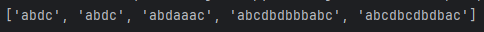
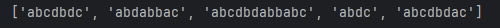

# Laboratory Work #1
## Course  Formal Languages & Finite Automata
## Author: Maxim Comarov FAF-221
## Variant - 7
Theory: 

**Grammar**: Grammar is a set of instructions for building sentences. It's like a guide that shows you how to put together different pieces (like words or symbols) to form sentences that follow specific rules.

**Alphabet**: Alphabet is like  a box of building blocks. Each block is a letter or symbol. Just like how the English alphabet has letters from A to Z, in this context, your alphabet can have different kinds of symbols that you use to build sentences following the grammar's instructions.
## Objectives:
* sdf
* dsf
## Implementation details
Certainly! Here's the explanation with relevant code snippets included in Markdown format:

---

**Class Definition - `Grammar`**  
Defines a blueprint or template named `Grammar`. It's a set of instructions for creating and working with a grammar.
```python
class Grammar:
    def __init__(self, terminals, non_terminals, rules, start_symbol):
        # ...
```

**Initialization Method - `__init__`**  
A special method that sets up each new `Grammar` object. It includes the grammar's alphabet (letters and symbols), non-terminals, rules, and the start symbol.
```python
def __init__(self, terminals, non_terminals, rules, start_symbol):
    self.terminals = terminals
    self.non_terminals = non_terminals
    self.rules = rules
    self.start_symbol = start_symbol
```

**Method `_generate_string_from_symbol`**  
Acts like a sentence builder. It uses the grammar's rules to create a valid sentence or string from a given symbol. The `depth` parameter ensures sentences don’t get too long or complex.
```python
def _generate_string_from_symbol(self, symbol, depth=0):
    # Recursive implementation
```

**Method `generate_valid_strings`**  
Functions like a factory creating multiple sentences. It calls the sentence builder method to create a specified number of valid sentences.
```python
def generate_valid_strings(self, n=5):
    # Loop to generate multiple strings
```

**Variables `terminals`, `non_terminals`, `rules`, `start_symbol`**  
The ingredients of the grammar:
- `terminals`: The basic symbols or letters.
- `non_terminals`: Larger sentence parts.
- `rules`: Combining instructions for terminals and non-terminals.
- `start_symbol`: The starting point for building sentences.
```python
terminals = ['a', 'b', 'c', 'd']
non_terminals = ['S', 'D', 'E', 'F', 'L']
rules = { # ... }
start_symbol = 'S'
```

**Creating an Instance of `Grammar` and Generating Strings**  
Putting everything into action by creating a `Grammar` instance and generating valid sentences.
```python
grammar = Grammar(terminals, non_terminals, rules, start_symbol)
valid_strings = grammar.generate_valid_strings()
```

## Conclusions

This implementation of the Grammar class in Python demonstrates a practical approach to generating strings based on a defined set of grammar rules. Each component of the class, from the initialization to the recursive string generation, contributes to a comprehensive system for exploring and utilizing the concepts of formal grammar and language generation in programming.

By adjusting the rules and symbols within the Grammar class, this code can be adapted to various grammatical structures, making it a versatile tool for linguistic and computational experiments. The balance between recursion depth control and randomness in string generation ensures both variety and adherence to the grammar rules.




