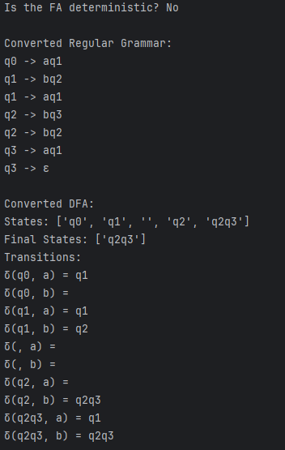

# Laboratory Work #2
## Course: Formal Languages & Finite Automata
## Author: Maxim Comarov FAF-221
## Variant: 7

## Theory

**Finite Automaton (FA)**: A finite automaton is a simple machine used to recognize patterns within input strings. It consists of states and transitions between those states based on input symbols from an alphabet.

**Deterministic Finite Automaton (DFA)**: A DFA is a type of finite automaton where for every state and symbol, there is exactly one transition. It's like a straight path where every step is clear and leads to a specific next step.

**Non-Deterministic Finite Automaton (NDFA)**: Unlike DFA, an NDFA can have multiple transitions for the same state and input symbol or even transitions without any input symbols (epsilon transitions). It's like standing at a crossroad where multiple paths are available, and you can choose any or even leap without taking a step.

**Regular Grammar**: Regular grammars are a way to describe the syntax of a language with rules. They are used to generate strings that belong to a particular language and can be directly related to finite automata for language recognition.

## Objectives

- Implement a conversion of a finite automaton to a regular grammar.
- Determine whether the finite automaton is deterministic (DFA) or non-deterministic (NDFA).
- Convert a non-deterministic finite automaton (NDFA) to a deterministic finite automaton (DFA).

## Implementation Details


**Conversion to Regular Grammar**    
A method within the Finite Automaton class converts the FA to a regular grammar by creating production rules based on the FA's transitions.
```python
def fa_to_regular_grammar(states, transitions, final_states):
    grammar = {}
    for state in states:
        grammar[state] = []
        for (src, symbol), dests in transitions.items():
            if src == state:
                for dest in dests:
                    grammar[state].append((symbol, dest))
        if state in final_states:
            grammar[state].append(('', 'ε'))
    return grammar


```
**Determinism Check**   
Determines if the FA is a DFA or an NDFA by checking the uniqueness of transitions for each state and input symbol combination.
```python
def is_deterministic(transitions):
    for dests in transitions.values():
        if len(dests) > 1:
            return False
    return True
```
**NDFA to DFA Conversion**    
Converts an NDFA to a DFA by creating new states representing combinations of NDFA states and redefining transitions.
```python
def ndfa_to_dfa(states, alphabet, transitions, final_states):
    new_states = [set(['q0'])]  
    dfa_transitions = {}
    dfa_states = []
    dfa_final_states = []

    while len(new_states) > 0:
        current = new_states.pop(0)
        current_name = ''.join(sorted(current))
        if current_name not in dfa_states:
            dfa_states.append(current_name)
            if current & set(final_states):
                dfa_final_states.append(current_name)
            for symbol in alphabet:
                next_state = set()
                for state in current:
                    if (state, symbol) in transitions:
                        next_state.update(transitions[(state, symbol)])
                next_state_name = ''.join(sorted(next_state))
                dfa_transitions[(current_name, symbol)] = next_state_name
                if next_state not in new_states and next_state_name not in dfa_states:
                    new_states.append(next_state)
    return dfa_states, dfa_transitions, dfa_final_states
```
**Screen of program output**    

## Conclusions
This laboratory work provides a foundational understanding of finite automata, their classification into deterministic and non-deterministic types, and their relationship with regular grammars. The practical implementation of conversions between different representations deepens the comprehension of theoretical concepts, illustrating the direct application of formal languages and automata theory in computational contexts.