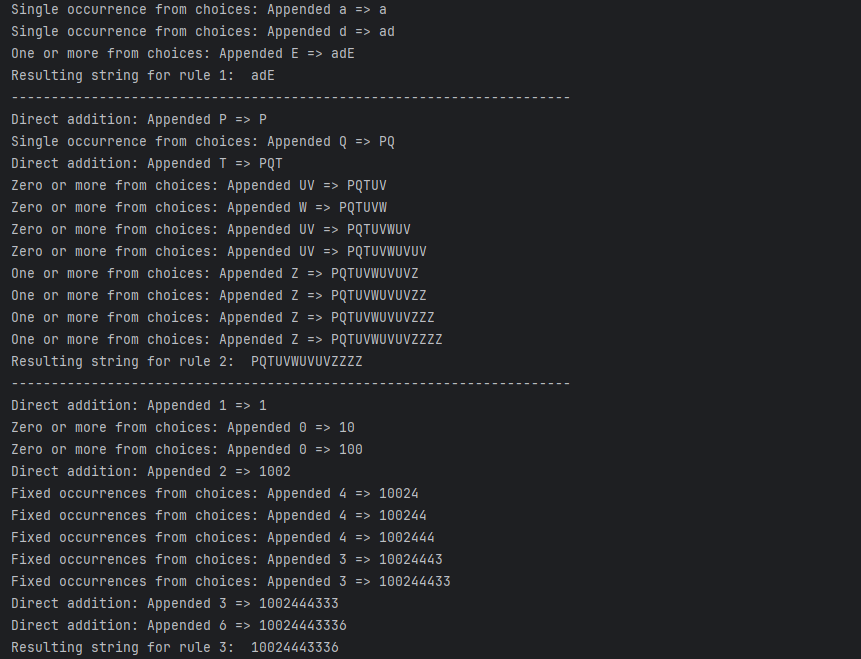
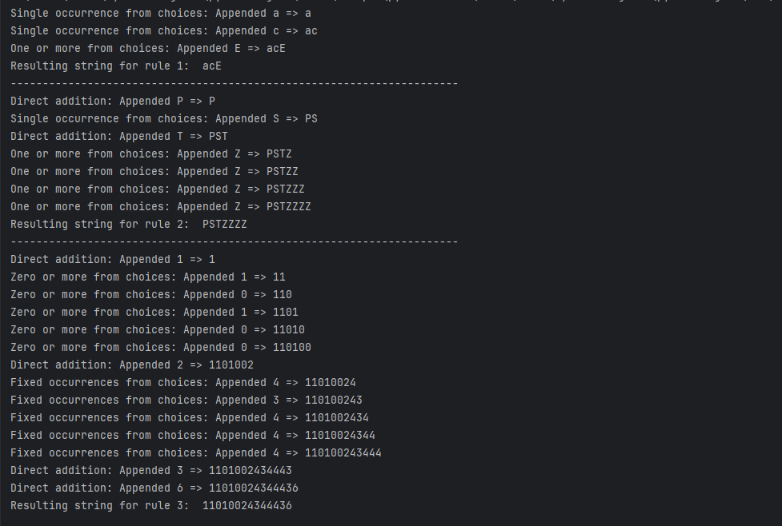

# Laboratory work #4
## Course: Formal Languages & Finite Automata.
## Topic: Regular expressions
### Author: Maxim Comarov.
### Variant: 1.

----
## Theory

&ensp;&ensp;&ensp; Regular expressions (called REs, or regexes, or regex patterns) are essentially a tiny, highly specialized 
programming language embedded inside Python and made available through the re module. Using this little language, you specify 
the rules for the set of possible strings that you want to match; this set might contain English sentences, or e-mail addresses, 
or TeX commands, or anything you like. You can then ask questions such as “Does this string match the pattern?”, or “Is there a 
match for the pattern anywhere in this string?”. You can also use REs to modify a string or to split it apart in various ways.

&ensp;&ensp;&ensp; Regular expression patterns are compiled into a series of bytecodes which are then executed by a matching engine written in C. 
For advanced use, it may be necessary to pay careful attention to how the engine will execute a given RE, and write the RE in a 
certain way in order to produce bytecode that runs faster.

&ensp;&ensp;&ensp; The regular expression language is relatively small and restricted, so not all possible string processing tasks can be done 
using regular expressions. There are also tasks that can be done with regular expressions, but the expressions turn out to 
be very complicated. In these cases, you may be better off writing Python code to do the processing; while Python code will 
be slower than an elaborate regular expression, it will also probably be more understandable.

## Task:

1. Write and cover what regular expressions are, what they are used for;

2. Below you will find 3 complex regular expressions per each variant. Take a variant depending on your number in the list of students and do the following:

    a. Write a code that will generate valid combinations of symbols conform given regular expressions (examples will be shown).

    b. In case you have an example, where symbol may be written undefined number of times, take a limit of 5 times (to evade generation of extremely long combinations);

    c. **Bonus point**: write a function that will show sequence of processing regular expression (like, what you do first, second and so on)

Examples of what must be generated:

{acEG, bdE, adEEG, ...} ,{PQTUVUVZ, PRTWWWWZ, ...}, {1023333336, 1124444436, ...}

## Implementation:
The implementation is easy as it possible: In the while loop program looks for either special symbols (" ? " , " * " , " + ") either single choice by option ( "|" ) either given number of repetitions (^int) either directly adds whatever is in the rule (" 1 ", " 36 "). If there is some special symbols randomly adds the repetitions (max number of repetitions is 5 for code optimization).

## Results:
Example 1:

Example 2:

## Conclusions

This laboratory exercise showcases an effective method for grasping and executing fundamental aspects of regular expressions via Python programming. By establishing specific rules and implementing logical operations to create strings adhering to these guidelines, it elucidates the utility of regular expressions in tasks involving text creation and editing.

Although this implementation offers a basic rendition of regular expression capabilities, it serves as an interactive medium to understand the underlying principles of regular expressions and their use in text handling and modification. Future improvements might focus on extending the features to encompass advanced regular expression functionalities and refining the codebase for enhanced performance and clarity.
