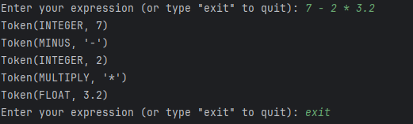
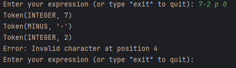

## Introduction

In this lab, we focused on constructing a lexer, which is a critical component in the process of lexical analysis, an essential step in parsing and compiling programming languages. The lexer, also known as a tokenizer or scanner, converts a sequence of input characters into a series of tokens, based on the syntax rules of the language.

## Objectives

- Understand the concept and importance of lexical analysis.
- Explore the internal workings of a lexer.
- Implement a lexer in Python that can efficiently tokenize a string into different types of tokens.

## Methodology

The implementation involved creating a Python application that consisted of:

- A `Token` class to represent the tokens generated by the lexer.
- A `Lexer` class that performs the actual tokenization process, converting an input string into a series of tokens.

## Lexer Implementation Overview

The lexer was structured into several key components:

- **Token Class**: Represented a token with a specified type and text.
- **Lexer Class**: Processed the input string to convert it into tokens, distinguishing between different characters and sequences by assigning them to the appropriate token types.

The lexer's processing involved analyzing the input text character by character, identifying numbers, operators, identifiers, and parentheses, and omitting whitespace, while unexpected characters triggered exceptions.

## How the Lexer Works

The lexer in this program scans the input string character by character, grouping these characters into tokens based on specific rules. The process involves the following steps:

1. **Initialization**: Upon receiving an input string, the lexer initializes with this string and sets a position indicator to track its progress through the string.

2. **Character Analysis and Token Generation**: The lexer examines each character to determine its type and form tokens accordingly. Key operations include:

3. **Number Tokenization**: Encountering a digit or a decimal point initiates the collection of characters to form either an integer or a floating-point number, resulting in an INTEGER or FLOAT token, respectively. It accumulates digits (and a single decimal point for floats) to complete the numeric token.

4. **Mathematical Operator Recognition**: Upon detecting characters like +, -, *, or /, the lexer generates corresponding tokens (PLUS, MINUS, MULTIPLY, DIVIDE) to represent these mathematical operators.

5. **Parenthesis Handling**: Open ( and close ) parentheses characters lead to the creation of LPAREN and RPAREN tokens, respectively, important for indicating grouping in expressions.

6. **Whitespace Skipping**: The lexer ignores whitespace characters as they serve only to separate tokens, not as tokens themselves.

7. **Error Handling**: Unlike traditional lexers that might throw an exception for unexpected characters, this lexer prints an error message and prompts the user for a new input string. This approach provides an opportunity to correct mistakes or enter a new expression without stopping the program.

8. **Token Stream Production**: The lexer constructs a sequence of tokens as it parses through the input. This stream of tokens is ready for further processing, typically parsing, which interprets the syntactic structure of the expression based on the tokens.

The lexer's approach to systematically converting an input string into a series of tokens is foundational for the analysis and interpretation phases that follow, such as parsing. This step is crucial for understanding the syntactic structure of the input, whether in compiling or interpreting the expression.

# Implementation Details
## Token Types

**The lexer supports the following token types:**

**INTEGER**: For whole numbers

**FLOAT**: For decimal numbers

**PLUS, MINUS, MULTIPLY, DIVIDE**: Mathematical operators

**LPAREN, RPAREN**: Parentheses for grouping

**EOF**: To denote the end of the input

Classes and Methods
**Token**

A simple class to represent tokens. Each token has a type and a value.

**Lexer**

The core class responsible for the lexical analysis. It includes methods for advancing through the text, skipping whitespace, parsing numbers (both integers and floats), and generating tokens.

**Key Methods:**

**advance()**: Moves the pointer to the next character.

**skip_whitespace()**: Skips over spaces in the input.

**number()**: Parses both integers and floating-point numbers.

**get_next_token()**: The main method that tokenizes the input.

**Error Handling**

Instead of raising an exception upon encountering an invalid character, the lexer  prints an error message and prompts the user to enter a new expression indicating to the wrong symbol. This loop continues until a valid expression is entered or the user types "exit".

**Support for Floating-Point Numbers**

The lexer can now recognize and tokenize floating-point numbers by looking for digits that include a decimal point. This was achieved by enhancing the number method to count decimal points and create either FLOAT or INTEGER tokens accordingly.

**Example Usage**

The user is prompted to enter an expression. The lexer then tokenizes the input and prints out the tokens until the end of the input is reached or an invalid character is detected. Here's an example:

**The correct variant:**

**If there is a wrong symbol in the promt:**

## Conclusion
The developed lexer efficiently tokenizes mathematical expressions, correctly handling integers, floating-point numbers, operators, and parentheses. Its architecture facilitates further extension and integration into compilers or interpreters, laying the groundwork for syntactic and semantic analysis of mathematical expressions. The lexer's design, focusing on clarity, error tolerance, and user interaction, demonstrates a pragmatic approach to lexical analysis.